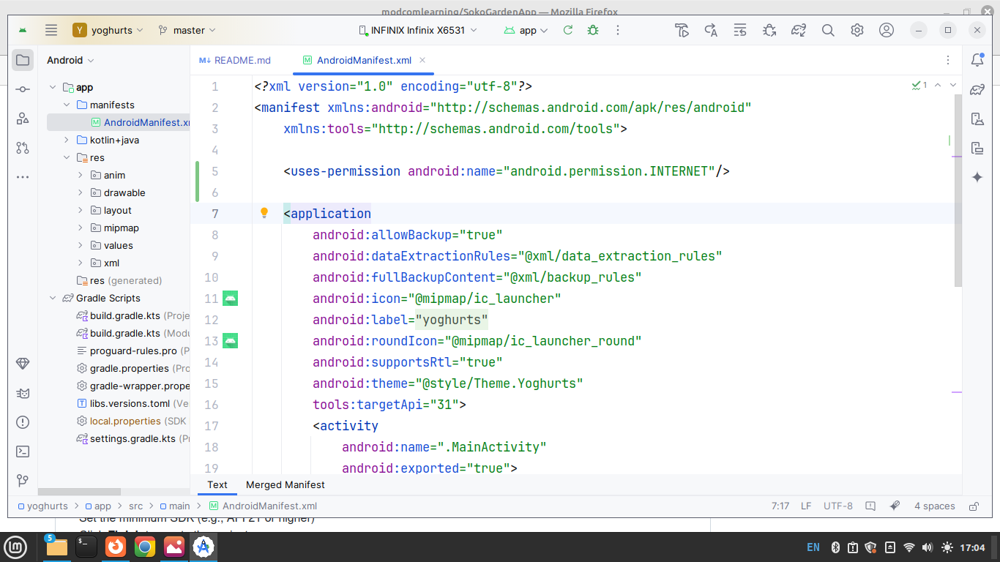
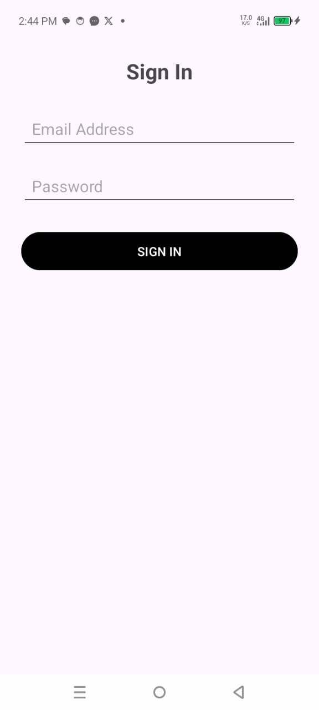
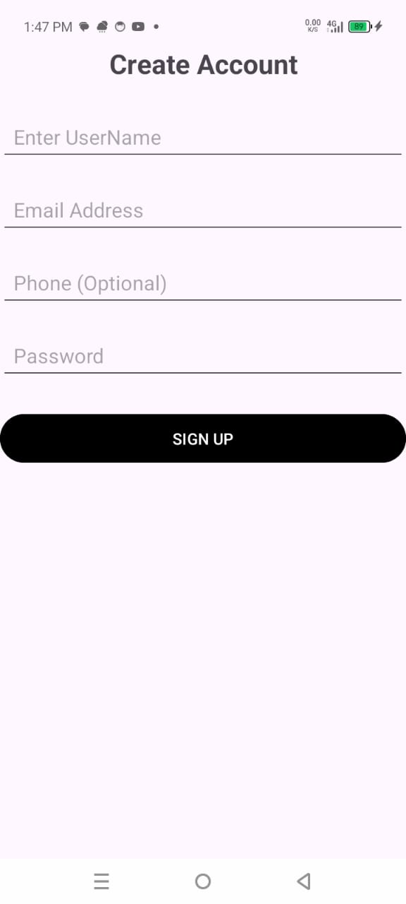
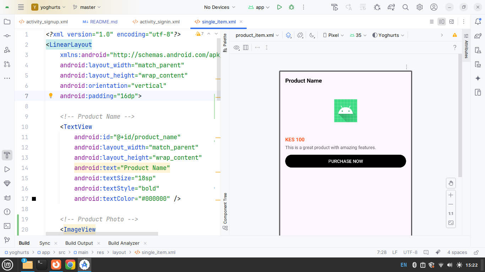
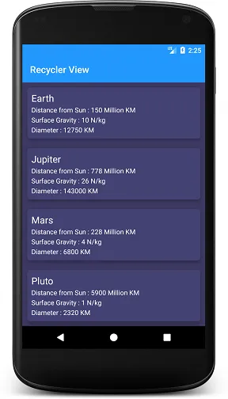
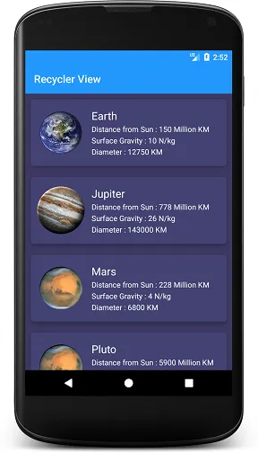
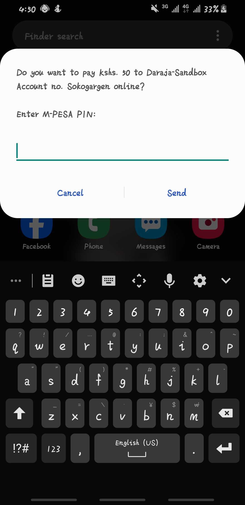

## Android App Project Overview
In this repository, we will create an Android application that interacts with an external API hosted at:
👉 https://github.com/modcomlearning/BackendAPI

This app will serve as an e-commerce client that communicates with the backend to handle users, products and transactions.

📱 <b>App Features </b>

The Android app will include the following main pages:
<br>
1. Main Page – Landing screen with general app info or product listing
2. Signup Page – Allows new users to register
3. Signin Page – Allows existing users to log in
4. Buy Products Page – Displays available products and allows users to select
5. Make Payment Page – Final checkout and payment interface
<br>
<b>App Demo.</b><br>

### 🛠️ Step 1: Create a New Android Project
To get started:

Open Android Studio <br>

Click on "New Project" <br>

Choose an appropriate template (use., Empty Views Activity) <br>

<b>Name the project:</b>
 <i>YourName_Project </i>

(Replace YourName with your actual name)
<br>
Choose the programming language -  Kotlin.
<br>
Set the minimum SDK (e.g., API 21 or higher)
<br>
Click <b>Finish</b> to create the project

In Your New Created Project, The MainActivity is Created.
Next, Go to <b>res - layout - activity_main.xml</b> , In this Layout Create a Main Page of our application.

```xml
<?xml version="1.0" encoding="utf-8"?>
<LinearLayout xmlns:android="http://schemas.android.com/apk/res/android"
    xmlns:app="http://schemas.android.com/apk/res-auto"
    xmlns:tools="http://schemas.android.com/tools"
    android:id="@+id/main"
    android:layout_width="match_parent"
    android:layout_height="match_parent"
    android:orientation="vertical"
    tools:context=".MainActivity">
    <TextView
        android:layout_width="match_parent"
        android:layout_height="wrap_content"
        android:text="DailyYoghurts"
        android:background="@drawable/shape"
        android:textColor="@color/white"
        android:textSize="40sp"
        android:textAlignment="center"
        android:layout_marginBottom="10dp"
        android:textStyle="bold"/>
    <Button
        android:layout_width="match_parent"
        android:layout_height="wrap_content"
        android:text="Sign Up"
        android:backgroundTint="#448AFF"
        android:id="@+id/signup"/>
    <Button
        android:layout_width="match_parent"
        android:layout_height="wrap_content"
        android:text="Sign In"
        android:backgroundTint="#40C4FF"
        android:id="@+id/signin"/>
</LinearLayout>
```

Above LinearLayout holds a TextView and Two buttons namely Sign Up and Sign in.
Output


<b>Add App Dependencies </b> <br>
During the development of this app, we will need to add below dependencies to be used in api access and image loading
<br>
In your App gradle files, open build.gradle - (Module App) and add below lines under dependencies.

```kotlin
   dependencies {
       
       ...
 
    implementation("com.github.bumptech.glide:glide:4.16.0")
    annotationProcessor("com.github.bumptech.glide:compiler:4.16.0")
    implementation("com.loopj.android:android-async-http:1.4.11")
}
```
Click on Sync Project.

Next Go to https://justpaste.it/iyuh1 , Copy the ApiHelper Class code ans Paste in Your Main App Package.
The ApiHelper class will be used in APIs Access.

Finally, Add Internet permissions in AndroidManifest File.<br>
In your App, Go to manifests Folder, open AndroidManifest.xml, Before the application tag add below code.

```xml
    <uses-permission android:name="android.permission.INTERNET"/>
```

Complete Manifest File<br>



Internet Permissions allow the app to connect to the internet.<br>

Run App.

### 🛠️ Step 2: Creating a Signin Activity
In this Step, we create a Signin Functionality for our App. This will be used by users to Login to the application. Signin Activity connects to API Created in https://github.com/modcomlearning/BackendAPI   Step 5 <br>
Right Click on App  - <b>New - Activity - Select Empty Views Activity </b> template<br> Give this Activity the name "Signin" Click Finish.
<br>

In the New Created Activity, Open res-layout-activity_signin.xml and create below layout

```xml
<?xml version="1.0" encoding="utf-8"?>
<LinearLayout xmlns:android="http://schemas.android.com/apk/res/android"
    xmlns:app="http://schemas.android.com/apk/res-auto"
    xmlns:tools="http://schemas.android.com/tools"
    android:id="@+id/main"
    android:layout_width="match_parent"
    android:layout_height="match_parent"
    android:orientation="vertical"
    android:padding="20dp"
    tools:context=".Signin">

        <TextView
            android:layout_width="match_parent"
            android:layout_height="wrap_content"
            android:text="Sign In"
            android:textSize="24sp"
            android:textStyle="bold"
            android:gravity="center"
            android:layout_marginBottom="24dp" />

        <EditText
            android:id="@+id/email"
            android:layout_width="match_parent"
            android:layout_height="wrap_content"
            android:hint="Email Address"
            android:inputType="textEmailAddress"
            android:padding="12dp"
            android:layout_marginBottom="16dp" />

        <EditText
            android:id="@+id/password"
            android:layout_width="match_parent"
            android:layout_height="wrap_content"
            android:hint="Password"
            android:inputType="textPassword"
            android:padding="12dp"
            android:layout_marginBottom="24dp" />

        <Button
            android:id="@+id/signin"
            android:layout_width="match_parent"
            android:layout_height="wrap_content"
            android:text="SIGN IN"
            android:backgroundTint="#000000"
            android:textColor="#FFFFFF"
            android:padding="12dp" />

    </LinearLayout>

```
<b>In Above Layout; </b> <br>
1. There are Two EditTexts withs ids @+id/email and @+id/password. <br>
2. There is one button with id @+id/signin  <br>

Next, Go to Kotlin + Java Folder, Open Signin Kotlin Class and update your code to look like below.

```kotlin
import android.os.Bundle
import android.widget.Button
import android.widget.EditText
import androidx.activity.enableEdgeToEdge
import androidx.appcompat.app.AppCompatActivity
import androidx.core.view.ViewCompat
import androidx.core.view.WindowInsetsCompat
import com.loopj.android.http.RequestParams
import com.modcom.yoghurts.ApiHelper
import com.modcom.yoghurts.R

class Signin : AppCompatActivity() {
    override fun onCreate(savedInstanceState: Bundle?) {
        super.onCreate(savedInstanceState)
        enableEdgeToEdge()
        setContentView(R.layout.activity_signin)
        ViewCompat.setOnApplyWindowInsetsListener(findViewById(R.id.main)) { v, insets ->
            val systemBars = insets.getInsets(WindowInsetsCompat.Type.systemBars())
            v.setPadding(systemBars.left, systemBars.top, systemBars.right, systemBars.bottom)
            insets
        }
        //Find Views By ID
        val email = findViewById<EditText>(R.id.email)
        val password = findViewById<EditText>(R.id.password)
        val signin = findViewById<Button>(R.id.signin)

        //Set Button Listener
        signin.setOnClickListener {
            //Set API - Endpoint
            val api = "https://modcom2.pythonanywhere.com/api/signin"
            //Add texts from EditTexts to RequestParams, email, password
            val data = RequestParams()
            data.put("email", email.text.toString().trim())
            data.put("password", password.text.toString().trim())
            //Access helper and Post
            val helper = ApiHelper(applicationContext)
            helper.post_login(api, data)
        }
    }
}
```
<b>Above Code;</b>
1. Finds the 2 EditTexts and 1 Button

       val email = findViewById<EditText>(R.id.email)
       val password = findViewById<EditText>(R.id.password)
       val signin = findViewById<Button>(R.id.signin)

2. Sets Listener to Button (Listens when Button is Clicked)

       signin.setOnClickListener {
           ...
3. Specifies the API Endpoint

       val api = "https://modcom2.pythonanywhere.com/api/signin"

4. Gets all Texts/Values entered by user in EditTexts, Put the them in RequestParams

       val data = RequestParams()
       data.put("email", email.text.toString().trim()) 
       data.put("password", password.text.toString().trim())

5. Access the ApiHelper and Sends the data to API

       val helper = ApiHelper(applicationContext)
       //Post the data to our API
       helper.post_login(api, data)

<br>
   
Finally, we need to Link the Signin Button from MainActivity to Link/Intent to Signin Activity, To do this Open MainActivity and add below code inside onCreate Function.

```kotlin
  val signin = findViewById<Button>(R.id.signin)
  signin.setOnClickListener {
   val intent = Intent(applicationContext, Signin::class.java)
   startActivity(intent)
  }
```


Run App
Click on Sign In Button, It Opens a Sign up Form, Fill in Details and Submit
The Data is sent to out API.

<p float="left">
  
  
</p>


### 🛠️ Step 3: Creating a Signup Activity
In this step we create a Signup Activity, This Activity will have a registration form with for fields namely username, email, phone and password. This Activity connects to API Created in https://github.com/modcomlearning/BackendAPI Step 4 <br>
Right Click on App  - <b>New- Activity - Select Empty Views Activity </b> template<br> Give this Activity the name "Signup" Click Finish.
<br>

In the New Created Activity, Open <b>res-layout-activity_signup.xml</b> and create below layout

```xml
<?xml version="1.0" encoding="utf-8"?>
    <LinearLayout
        xmlns:android="http://schemas.android.com/apk/res/android"
        xmlns:app="http://schemas.android.com/apk/res-auto"
        xmlns:tools="http://schemas.android.com/tools"
        android:layout_width="match_parent"
        android:layout_height="wrap_content"
        android:layout_margin="20dp"
        android:orientation="vertical">

        <TextView
            android:layout_width="match_parent"
            android:layout_height="wrap_content"
            android:text="Create Account"
            android:textSize="24sp"
            android:textStyle="bold"
            android:gravity="center"
            android:layout_marginBottom="24dp" />

        <EditText
            android:id="@+id/username"
            android:layout_width="match_parent"
            android:layout_height="wrap_content"
            android:hint="Enter UserName"
            android:inputType="textPersonName"
            android:padding="12dp"
            android:layout_marginBottom="16dp" />

        <EditText
            android:id="@+id/email"
            android:layout_width="match_parent"
            android:layout_height="wrap_content"
            android:hint="Email Address"
            android:inputType="textEmailAddress"
            android:padding="12dp"
            android:layout_marginBottom="16dp" />
        <EditText
            android:id="@+id/phone"
            android:layout_width="match_parent"
            android:layout_height="wrap_content"
            android:hint="Phone (Optional)"
            android:inputType="phone"
            android:padding="12dp"
            android:layout_marginBottom="16dp" />


        <EditText
            android:id="@+id/password"
            android:layout_width="match_parent"
            android:layout_height="wrap_content"
            android:hint="Password"
            android:inputType="textPassword"
            android:padding="12dp"
            android:layout_marginBottom="24dp" />

        <Button
            android:id="@+id/signup"
            android:layout_width="match_parent"
            android:layout_height="wrap_content"
            android:text="SIGN UP"
            android:backgroundTint="#000000"
            android:textColor="#FFFFFF"
            android:padding="12dp" />
    </LinearLayout>

```

In above XML Layout we have 4 EditTexts, note that each EditText has a unique ID as well as the Signup Button.


<br>
Next, Create the Layout logic to capture user entered data and send to our API.
Find Sign up API under https://github.com/modcomlearning/BackendAPI  Step 4
<br>
Go to kotlin + java, Open Signup.kt and update the Activity as shown in below Code.
<br>

```kotlin

import android.os.Bundle
import android.widget.Button
import android.widget.EditText
import androidx.activity.enableEdgeToEdge
import androidx.appcompat.app.AppCompatActivity
import androidx.core.view.ViewCompat
import androidx.core.view.WindowInsetsCompat
import com.loopj.android.http.RequestParams

class Signup : AppCompatActivity() {
    override fun onCreate(savedInstanceState: Bundle?) {
        super.onCreate(savedInstanceState)
        enableEdgeToEdge()
        setContentView(R.layout.activity_signup)
        ViewCompat.setOnApplyWindowInsetsListener(findViewById(R.id.main)) { v, insets ->
            val systemBars = insets.getInsets(WindowInsetsCompat.Type.systemBars())
            v.setPadding(systemBars.left, systemBars.top, systemBars.right, systemBars.bottom)
            insets
        }
        //Find Views By ID
        val username = findViewById<EditText>(R.id.username)
        val password = findViewById<EditText>(R.id.password)
        val email = findViewById<EditText>(R.id.email)
        val phone = findViewById<EditText>(R.id.phone)
        val signup = findViewById<Button>(R.id.signup)
        //Set Button Helper
        signup.setOnClickListener {
            //Set the API Endpoint URL
            val api = "https://modcom2.pythonanywhere.com/api/signup"
            
         //Put text/values from EditTexts to RequestParams - holds data
            val data = RequestParams()
            data.put("username", username.text.toString())
            data.put("password", password.text.toString())
            data.put("email", email.text.toString())
            data.put("phone", phone.text.toString())
            //Access ApiHelper Class
            val helper = ApiHelper(applicationContext)
            //Post the data to our API
            helper.post(api, data)
        }
    }
}
```

<b>Above Code;</b> <br>
1. Finds the 4 EditTexts and 1 Button

         val username = findViewById<EditText>(R.id.username)
         val password = findViewById<EditText>(R.id.password)
         val email = findViewById<EditText>(R.id.email)
         val phone = findViewById<EditText>(R.id.phone)
         val signup = findViewById<Button>(R.id.signup)

2. Sets Listener to Button (Listens when Button is Clicked)

         signup.setOnClickListener {
          ...
3. Specifies the API Endpoint

         val api = "https://modcom2.pythonanywhere.com/api/signup"

4. Gets all Texts/Values entered by user in EditTexts, Put the them in RequestParams

        val data = RequestParams() 
        data.put("username", username.text.toString())
        data.put("password", password.text.toString())
        data.put("email", email.text.toString())
        data.put("phone", phone.text.toString())

5. Access the APiHelper and Sends the data.

        val helper = ApiHelper(applicationContext)
        //Post the data to our API
        helper.post(api, data)


Finally, we need to Link the Signup Button in MainActivity to Link to Signup Activity, To do this Open MainActivity and add below code inside the onCreate function.

```kotlin
  val signup = findViewById<Button>(R.id.signup)
  signup.setOnClickListener {
   val intent = Intent(applicationContext, Signup::class.java)
   startActivity(intent)
  }
```

<b>Run App </b> <br>
Click on Sign Up Button, It Opens a Sign up Form, Fill in Details and Submit
The Data is sent to out API.

<p float="left">
  
  
</p>


### 🛠️ Step 4: Creating a Display Products Functionality.
In this Step, we create the Get Products Functionality, Here, all the products will be retrieved and displayed in MainActivity, Just below the Signin and Signup Buttons, See below screenshot, The Display Products Functionality in our App connect to API Created in https://github.com/modcomlearning/BackendAPI Step 6 <br>
<br>
<p float="left">
  
  
</p>
<br>
Products will be displayed in <b>MainActivity</b> <br>
To Start with, Create an XML Layout of how one Product will be displayed. To Create a New XML File,  Right Click on res Folder - <b>New -  XML - Layout XML File </b> <br>

Name this XML <b>single_item</b> and Create below Layout.

```xml
<?xml version="1.0" encoding="utf-8"?>
<LinearLayout
        xmlns:android="http://schemas.android.com/apk/res/android"
        android:layout_width="match_parent"
        android:layout_height="wrap_content"
        android:orientation="vertical"
        android:padding="16dp">

   <!-- Product Name -->
   <TextView
           android:id="@+id/product_name"
           android:layout_width="match_parent"
           android:layout_height="wrap_content"
           android:text="Product Name"
           android:textSize="18sp"
           android:textStyle="bold"
           android:textColor="#000000" />

   <!-- Product Photo -->
   <ImageView
           android:id="@+id/product_photo"
           android:layout_width="match_parent"
           android:layout_height="150dp"
           android:layout_marginTop="8dp"
           android:scaleType="centerInside"
           android:src="@mipmap/ic_launcher" />

   <!-- Product Cost -->
   <TextView
           android:id="@+id/product_cost"
           android:layout_width="match_parent"
           android:layout_height="wrap_content"
           android:text="KES 100"
           android:textStyle="bold"
           android:textSize="16sp"
           android:textColor="#FF5722"
           android:layout_marginTop="4dp" />

   <!-- Product Description -->
   <TextView
           android:id="@+id/product_description"
           android:layout_width="match_parent"
           android:layout_height="wrap_content"
           android:text="This is a great product with amazing features."
           android:textSize="14sp"
           android:textColor="#555555"
           android:layout_marginTop="4dp" />


   <Button
           android:layout_width="match_parent"
           android:layout_height="wrap_content"
           android:text="PURCHASE NOW"
           android:layout_marginBottom="20dp"
           android:layout_marginTop="10dp"
           android:id="@+id/purchase"
           android:backgroundTint="#000000"/>
</LinearLayout>
```

In Your Android Studio Layout View, It should look like this .



🤖 <b>What is a RecyclerView in Android? </b> <br>

 1. RecyclerView is a special view used to display a list of items (like names, products, messages) in a scrollable way.
 <br>
 2. It’s a better version of List — faster and more flexible.
<br>
 3. Example use: showing a list of products, contacts, or messages in your app.
<br>
<i>Example of a Recycler View Showing Planets </i> <br>

<p float="left">
  
  
</p>
<br>
🧩 <b>Why Do We Need an Adapter?</b> <br>

 1. The Adapter acts like a bridge between your data (like a list of products) and the RecyclerView UI.

 2. It takes each item in your list and tells RecyclerView how to show it on the screen.

 3. Without the adapter, RecyclerView won’t know what to display or how to display it.

Therefore, we need a RecyclerAdapter, Go to https://justpaste.it/h3e6v  and Copy the RecyclerAdapter Class, Paste it your App Main Package<br>

Then Go to activity_main.xml and add below 2 Views.

```xml
    <ProgressBar
        android:layout_width="match_parent"
        android:layout_height="wrap_content"
        android:id="@+id/progressbar"/>

    <androidx.recyclerview.widget.RecyclerView
        android:id="@+id/recyclerView"
        android:layout_width="match_parent"
        android:layout_height="wrap_content"
        tools:listitem="@layout/single_item"/>
```

In Above Code;
1.  <ProgressBar>  - Shows progress as we retrieve products.
2.  <RecyclerView> - Creates a List of Products, Links to single_item XML layout using <b>tools:listitem.</b>
                   - single_item - Helps recycler view kow how to display products.
<br>
NB: Check progressbar and recyclerview have unique IDS.<br>
<b>Your Complete activity_main.xml  </b> <br>

```xml
<?xml version="1.0" encoding="utf-8"?>
<LinearLayout xmlns:android="http://schemas.android.com/apk/res/android"
    xmlns:app="http://schemas.android.com/apk/res-auto"
    xmlns:tools="http://schemas.android.com/tools"
    android:id="@+id/main"
    android:layout_width="match_parent"
    android:layout_height="match_parent"
    android:orientation="vertical"
    tools:context=".MainActivity">
    <TextView
        android:layout_width="match_parent"
        android:layout_height="wrap_content"
        android:text="DailyYoghurts"
        android:background="@drawable/shape"
        android:textColor="@color/white"
        android:textSize="40sp"
        android:textAlignment="center"
        android:layout_marginBottom="10dp"
        android:textStyle="bold"/>
    <Button
        android:layout_width="match_parent"
        android:layout_height="wrap_content"
        android:text="Sign Up"
        android:backgroundTint="#448AFF"
        android:id="@+id/signup"/>
    <Button
        android:layout_width="match_parent"
        android:layout_height="wrap_content"
        android:text="Sign In"
        android:backgroundTint="#40C4FF"
        android:id="@+id/signin"/>


    <ProgressBar
        android:layout_width="match_parent"
        android:layout_height="wrap_content"
        android:id="@+id/progressbar"/>

    <androidx.recyclerview.widget.RecyclerView
        android:id="@+id/recyclerView"
        android:layout_width="match_parent"
        android:layout_height="wrap_content"
        tools:listitem="@layout/single_item"/>
   
</LinearLayout>
```

Next, Go to kotlin + java Folder, In your Main Package, Open MainActivity and write below Code.

```kotlin
        // Fetch recylerview and progressbar
        val progressBar = findViewById<ProgressBar>(R.id.progressbar)
        val recyclerView = findViewById<RecyclerView>(R.id.recyclerView)

        //  Define your url
        val url = "https://modcom2.pythonanywhere.com/api/get_product_details"

        //  Get the object of class APiHelper
        val helper = ApiHelper(applicationContext)

        //  We have a function called loadProducts, its inside ApiHelper
        //  Pass the 3 arguments which are url(api endpoint), recyclerview and progressbar
        helper.loadProducts(url, recyclerView, progressBar )
```

Abode Code;
1.  Fetch/Find recylerview and progressbar from activity_main XML Layout

          val progressBar = findViewById<ProgressBar>(R.id.progressbar)
          val recyclerView = findViewById<RecyclerView>(R.id.recyclerView)
2. Define your api url

          val url = "https://modcom2.pythonanywhere.com/api/get_product_details"

3. Access APiHelper Class

          val helper = ApiHelper(applicationContext)

4. Access/Call loadProducts Function from ApiHelper, loadProducts Function take 3 arguments namely api url, recyclerview and progressbar

          helper.loadProducts(url, recyclerView, progressBar )

<br><br>
<b>Run App. </b> <br>
The App loads products in a recycler view. The progressbar is used to show progress as products load<br>
<br>


### 🛠️ Step 5: Creating MakePayment Activity
In this Step, We create a MakePayment Activity, This Functionality will be used to Make an MPESA STK Push when a user Clicks Purchase Now Button from any Product. Check Step 4 on how products are displayed.
<br>

Right Click on App  - <b>New- Activity - Select Empty Views Activity </b> template<br> Give this Activity the name "MakePayment" Click Finish. 

A New MakePayment Activity is Created and a Corresponding activity_payment.xml is created as well, Open <b>res - layout - activity_payment.xml </b> and write below code.
Below XML Layout Created a Phone input where user will enter the phone number used in payment. <br>

activity_payment.xml

```xml
<?xml version="1.0" encoding="utf-8"?>
<LinearLayout xmlns:android="http://schemas.android.com/apk/res/android"
    xmlns:app="http://schemas.android.com/apk/res-auto"
    xmlns:tools="http://schemas.android.com/tools"
    android:id="@+id/main"
    android:layout_width="match_parent"
    android:layout_height="match_parent"
    android:orientation="vertical"
    android:padding="20dp"
    tools:context=".PaymentActivity">
    
        <TextView
            android:id="@+id/txtProductName"
            android:layout_width="wrap_content"
            android:layout_height="wrap_content"
            android:text="Product Name"
            android:layout_marginTop="20dp"
            android:textSize="20sp"
            android:textStyle="bold" />

        <TextView
            android:id="@+id/txtProductCost"
            android:layout_width="wrap_content"
            android:layout_height="wrap_content"
            android:text="Ksh 0"
            android:textSize="18sp"
            android:textColor="#FF5722"
            android:layout_marginTop="8dp" />
        <EditText
            android:id="@+id/phone"
            android:layout_width="match_parent"
            android:layout_height="wrap_content"
            android:hint="Enter phone 254XXXXXXXX"
            android:textSize="18sp"
            android:textColorHint="#1E1C1B"
            android:layout_marginTop="8dp" />
        <Button
            android:layout_width="match_parent"
            android:layout_height="wrap_content"
            android:layout_marginTop="20dp"
            android:text="PAY NOW"
            android:backgroundTint="#000000"
            android:id="@+id/pay"/>
    
    </LinearLayout>

```
<br>
<b>Above Code; M</b> <br>
1. A LinearLayout -a ViewGroup Used to hold other Views vertically <br>
2. TextView to Hold product_name<br>
3. TextView to hold product_cost<br>
4. EditText to Input user PhoneNumber <br>
5. Clickable Button To Make Payment trigger.<br>

NB: Confirm that above Views have uniqui IDs.
<br>

Next, Open Product Class and uncomment below Commented code.
```kotlin
                holder.btnPurchase.setOnClickListener {
                    val context = holder.itemView.context
                    val intent = android.content.Intent(context, PaymentActivity::class.java).apply {
                        putExtra("product_id", product.product_id)
                        putExtra("product_name", product.product_name)
                        putExtra("product_description", product.product_description)
                        putExtra("product_cost", product.product_cost)
                        putExtra("product_photo", product.product_photo)
                    }
                    context.startActivity(intent)
                }
```

<b>Above code; </b> <br>
1. onClick on Purchase Button, Gets all Products Details.
2. Creates an Intent/Link to PaymentActivity Class passing all Products Details.
3. In Simple terms, above code Links/Intents to PaymentActivity carrying/pass Products Details namely product_name, product_cost etc.

Below shows how the navigation looks like when Purchase Now Button is Clicked<br>
<p float="left">
  
  
</p><br>


Next, We create Logic for MakePayment Activity.
In kotlin + java, Open MakePayment and Update as shown below. 

MakePayment Class 

```kotlin
package com.modcom.yoghurts
import android.os.Bundle
import android.widget.Button
import android.widget.EditText
import android.widget.ImageView
import android.widget.TextView
import androidx.activity.enableEdgeToEdge
import androidx.appcompat.app.AppCompatActivity
import androidx.core.view.ViewCompat
import androidx.core.view.WindowInsetsCompat
import com.bumptech.glide.Glide
import com.loopj.android.http.RequestParams
import com.modcom.yoghurts.ApiHelper
import com.modcom.yoghurts.R
import org.json.JSONObject

class PaymentActivity : AppCompatActivity() {
    override fun onCreate(savedInstanceState: Bundle?) {
        super.onCreate(savedInstanceState)
        enableEdgeToEdge()
        setContentView(R.layout.activity_payment)
        ViewCompat.setOnApplyWindowInsetsListener(findViewById(R.id.main)) { v, insets ->
            val systemBars = insets.getInsets(WindowInsetsCompat.Type.systemBars())
            v.setPadding(systemBars.left, systemBars.top, systemBars.right, systemBars.bottom)
            insets
        }
        //Receive/Retrieve Extras Data the product_name and product_cost
        //This data is passed via Intent
        val name = intent.getStringExtra("product_name")
        val cost = intent.getIntExtra("product_cost", 0)

        //Find the Name and Cost TextViews
        val txtName: TextView = findViewById(R.id.txtProductName)
        val txtCost: TextView = findViewById(R.id.txtProductCost)

        //Update TextViews with Values Passed Via Intent
        txtName.text = name
        txtCost.text = "Ksh $cost"

        //Find Pay/Purchase Button
        val btnPay: Button = findViewById(R.id.pay)
        //Find Phone number Edit Text
        val edtPhone: EditText = findViewById(R.id.phone)
        //Set Click CListener
        btnPay.setOnClickListener {
            //Set Api Endpoint
            val api = "https://modcom2.pythonanywhere.com/api/mpesa_payment"

            //Get the types phone number
            val phone = edtPhone.text.toString().trim()

            //Create data using RequestParams, put phone and cost as keyvalue pairs
            val data = RequestParams()
            data.put("amount", cost)  //Passed via Intent
            data.put("phone", phone)  // Entered by User in phone EditText

            //Access API helper
            val helper = ApiHelper(applicationContext)
            //Post data  to api endpoint
            helper.post(api, data)
        }
    }
    }

```

<b>Run App </b> <br>
Choose one Product, Click Purchase Now, It will navigate to MakePayment , showing the Product Name and Cost, Enter Phone Number (254XXXXXXX), Click Pay Now. Please Wait .... An MPESA Prompt is sent to the phone number for user to complete payment.<br>

<p float="left">
  
  
  
</p>
<br>

### 🛠️ Step 6: About Activity  - TextToSpeach
In this Step, we implement a Text-to-Speech (TTS) feature, which is a branch of Artificial Intelligence (AI).
TTS technology enables the application to convert written text into audible speech. As part of AI, it simulates human-like speech and improves user interaction, especially for accessibility purposes. This is useful for users with visual impairments, reading challenges, or those who prefer audio content.
<br>
In this step, we initialize the TTS engine, configure its settings (like language and pitch), and trigger speech output based on user interaction—bringing a smart, voice-enabled feature into the app.
Create a New Activity named About. To do this right click on app - New - Activity - Empty Views Activity.

First Link/Intent to this Activity from Main Activity.
In res-layout - activity_main.xml add an about button as shown below.

```xml
<?xml version="1.0" encoding="utf-8"?>
<LinearLayout xmlns:android="http://schemas.android.com/apk/res/android"
    xmlns:app="http://schemas.android.com/apk/res-auto"
    xmlns:tools="http://schemas.android.com/tools"
    android:id="@+id/main"
    android:layout_width="match_parent"
    android:layout_height="match_parent"
    android:orientation="vertical"
    android:layout_margin="20dp"
    tools:context=".MainActivity">
    <TextView
        android:layout_width="match_parent"
        android:layout_height="wrap_content"
        android:text="DailyYoghurts"
        android:background="@drawable/shape"
        android:textColor="@color/white"
        android:textSize="40sp"
        android:textAlignment="center"
        android:layout_marginBottom="10dp"
        android:textStyle="bold"/>

    <Button
        android:layout_width="match_parent"
        android:layout_height="wrap_content"
        android:text="Sign Up"
        android:backgroundTint="#448AFF"
        android:id="@+id/signup"/>
    <Button
        android:layout_width="match_parent"
        android:layout_height="wrap_content"
        android:text="Sign In"
        android:backgroundTint="#40C4FF"
        android:id="@+id/signin"/>

    <Button
        android:layout_width="match_parent"
        android:layout_height="wrap_content"
        android:text="About info"
        android:backgroundTint="#673AB7"
        android:id="@+id/about"/>


    <ProgressBar
        android:layout_width="match_parent"
        android:layout_height="wrap_content"
        android:id="@+id/progressbar"/>

    <androidx.recyclerview.widget.RecyclerView
        android:id="@+id/recyclerView"
        android:layout_width="match_parent"
        android:layout_height="wrap_content"
        tools:listitem="@layout/single_item"/>


</LinearLayout>
```
Then in Kotlin - MainActivity, add a Button Listener and intent to about as shown below.

```kotlin
      val about = findViewById<Button>(R.id.about)
      about.setOnClickListener {
         val intent = Intent(applicationContext, About::class.java)
         startActivity(intent)
      }
```

Now we implement an about us Activity, Open About XML - activity_about.xml.
```xml
      <LinearLayout xmlns:android="http://schemas.android.com/apk/res/android"
           android:orientation="vertical"
           android:padding="16dp"
           android:layout_width="match_parent"
           android:layout_margin="20dp"
           android:id="@+id/main"
           android:layout_height="match_parent">
   
      <TextView
              android:layout_width="match_parent"
              android:layout_height="wrap_content"
              android:text="About Info"
              android:textStyle="bold"
              android:textAlignment="center"
              android:textSize="30sp"/>
   
      <EditText
              android:id="@+id/textView"
              android:hint="Welcome to our eCommerce app, a simple and user-friendly platform designed to make online shopping easy and accessible for everyone. Users can quickly sign up to create an account, securely sign in, and browse a wide range of products with detailed descriptions and images. Our seamless checkout process allows customers to pay conveniently through M-Pesa"
              android:textSize="18sp"
              android:textColor="@color/black"
              android:padding="10dp"
              android:layout_width="wrap_content"
              android:layout_height="wrap_content" />
   
      <Button
              android:id="@+id/speakButton"
              android:text="Listen"
              android:layout_width="wrap_content"
              android:layout_height="wrap_content"
              android:layout_marginTop="24dp"/>
   </LinearLayout>
```

Then, Go to Kotlin - About Activity and implement text to speech.

```kotlin
package com.modcom.yoghurts
import android.os.Bundle
import android.speech.tts.TextToSpeech
import android.widget.Button
import android.widget.TextView
import androidx.activity.enableEdgeToEdge
import androidx.appcompat.app.AppCompatActivity
import androidx.core.view.ViewCompat
import androidx.core.view.WindowInsetsCompat
import java.util.Locale

class About : AppCompatActivity() {
    //Declare a tts variable.
    lateinit var tts: TextToSpeech
    override fun onCreate(savedInstanceState: Bundle?) {
        super.onCreate(savedInstanceState)
        enableEdgeToEdge()
        setContentView(R.layout.activity_about_faqs)
        ViewCompat.setOnApplyWindowInsetsListener(findViewById(R.id.main)) { v, insets ->
            val systemBars = insets.getInsets(WindowInsetsCompat.Type.systemBars())
            v.setPadding(systemBars.left, systemBars.top, systemBars.right, systemBars.bottom)
            insets
        }//end
        //find text view and button
        val textView = findViewById<TextView>(R.id.textView)
        val speakButton = findViewById<Button>(R.id.speakButton)
       //Create a TTS object, check if tts is available and set Language
        tts = TextToSpeech(this) {
            if (it == TextToSpeech.SUCCESS) {
                tts.language = Locale.US
            }
        }//end
        //Set button listener
        speakButton.setOnClickListener {
            val text = textView.text.toString() //get text from text View
            //ask tts to speak the text from textview above
            tts.speak(text, TextToSpeech.QUEUE_FLUSH, null, null) 
        }//end
    }//end
    
    //Stop the tts from speaking when app is closed/destroyed/killed
    override fun onDestroy() {
        tts.stop() //stops tts
        tts.shutdown()
        super.onDestroy()
    }
}
```

### Explanation of the Code (TTS Feature)

    lateinit var tts: TextToSpeech

This line declares a TTS variable that will be initialized later.

It finds the EditText (where the user types the text) and the Button (which will trigger the speech).
   
     val textView = findViewById<TextView>(R.id.textView)
     val speakButton = findViewById<Button>(R.id.speakButton)

Initialize TTS
This initializes the TTS engine.
If initialization is successful, the language is set to US English.

      tts = TextToSpeech(this) {
         if (it == TextToSpeech.SUCCESS) {
            tts.language = Locale.US
         }
      }


Set Button Click Listener
When the user clicks the button:
It gets the text from the EditText.
Then, the TTS engine reads the text out loud.

      speakButton.setOnClickListener {
         val text = textView.text.toString()
         tts.speak(text, TextToSpeech.QUEUE_FLUSH, null, null)
      }

Clean Up TTS in onDestroy()

      override fun onDestroy() {
         tts.stop()
         tts.shutdown()
         super.onDestroy()
      }

This stops and shuts down the TTS engine when the activity is closed, to free up system resources.

<b>Run App </b> <br>
Click on About Button, It Opens an About Activity - Click on Listen/Speak Button and the TextToSpeech Engine will read the Text for you!.

Output


### Conclusion.
In conclusion, this application is a functional and a powerful eCommerce app that includes essential features such as a main menu, user sign-up and sign-in, product display, and secure payments via M-Pesa. 
<br>
It also integrates a Text-to-Speech (TTS) feature powered by AI to enhance accessibility and user interaction. The app is built using Kotlin and XML, and it makes use of important components like API helpers and RecyclerView adapters for efficient data handling and user experience. 
<br>
This project creates a great opportunity for students to explore Android development, customize the UI, and build on the features to create even more advanced applications. Thank you!


